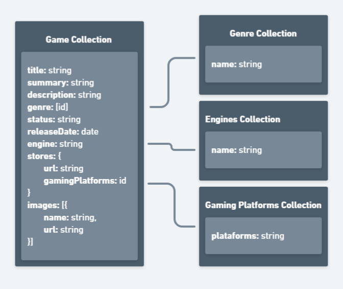

<h1 align="center">🎮 Game Database API</h1>

<p align="center">
  Rest API project to record and make data available about developed games.
</p>

<p align="center">
  
</p>

## Technologies

<table border="0">
  <tr>
    <td href="https://nodejs.org/en">
      <a href="https://nodejs.org/en">
        
      </a>
    </td>
    <td style="border:none"><a href="https://nodejs.org/en" target="_blank" >Node.js</a></td>
  </tr>
  <tr>
    <td>
      <a href="https://expressjs.com/pt-br/">
        
      </a>
    </td>
    <td><a href="https://expressjs.com/pt-br/" target="_blank" >Express</a></td>
  </tr>
  <tr>
    <td>
      <a href="https://www.mongodb.com/pt-br/docs/manual/">
        
      </a>
    </td>
    <td><a href="https://www.mongodb.com/pt-br/docs/manual/" target="_blank" >Mongodb</a></td>
  </tr>
  <tr>
    <td>
      <a href="https://swagger.io/docs/specification/basic-structure/">
        
      </a>
    </td>
    <td><a href="https://swagger.io/docs/specification/basic-structure/" target="_blank" >Swagger</a></td>
  </tr>
  <tr>
    <td>
      <a href="https://docs.docker.com/get-started/">
        
      </a>
    </td>
    <td><a href="https://docs.docker.com/get-started/" target="_blank" >Docker</a></td>
  </tr>
</table>


## Prerequisites
> [!WARNING]
> To run the project, you must install the following tools on your machine:
- [Node.js](https://nodejs.org/en): v18 or higher.
- [Docker](https://docs.docker.com/get-started/)

## Installation
Clone the repository to your computer
```
git clone https://github.com/MichaelDouglasPIX/game-database-api.git
```

Access the project
```
cd game-database-api
```

Install dependencies
```
npm i
```
## Run project locally

> [!IMPORTANT]
> Rename the `.env_example` into  `.env` and change the username and password fields. 

Start Docker containers
```
npm run start-docker
```

Start the server
```
npm run dev
```

Terminate Docker
```
npm run finish-docker
```

### Swagger and Mongo Express
After docker and server are running, it is possible to view some services.

- Visit `http://localhost:8082/` to view API documentation in Swagger UI.
- Visit `http://localhost:8081/` to view the automatically generated data in mongodb.

## License

[MIT licensed](LICENSE).


